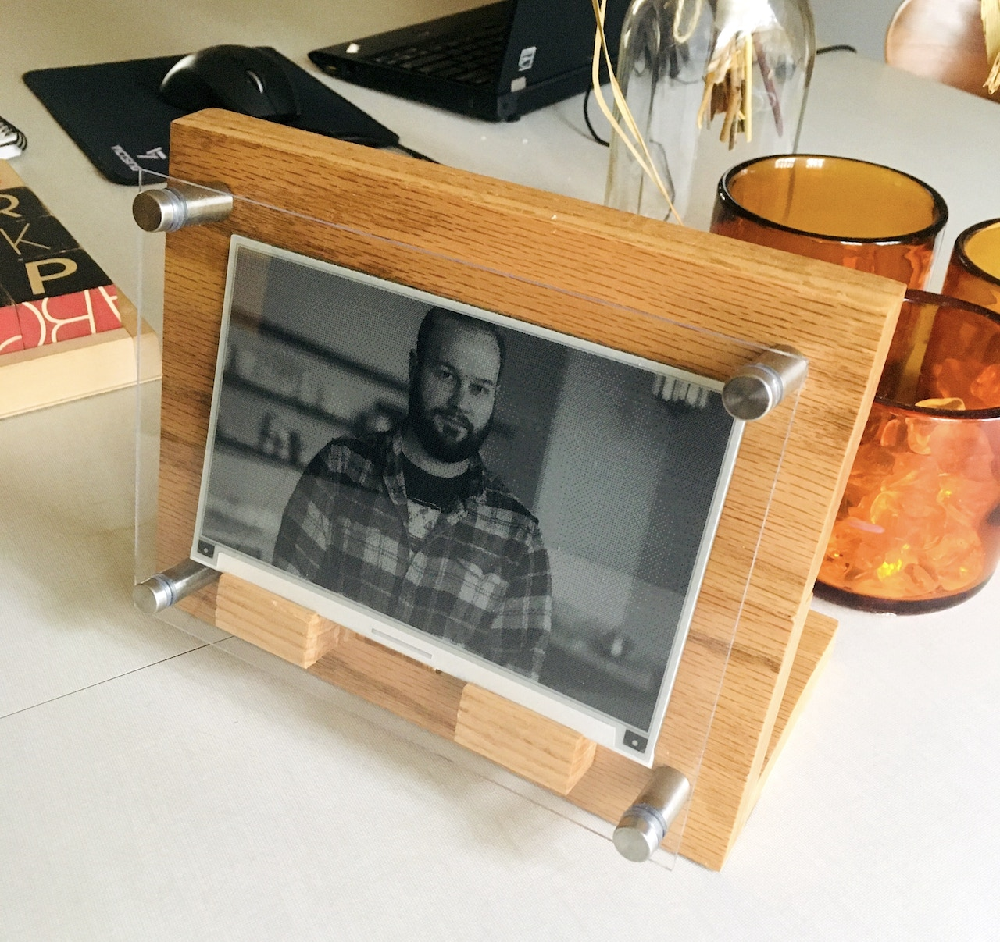
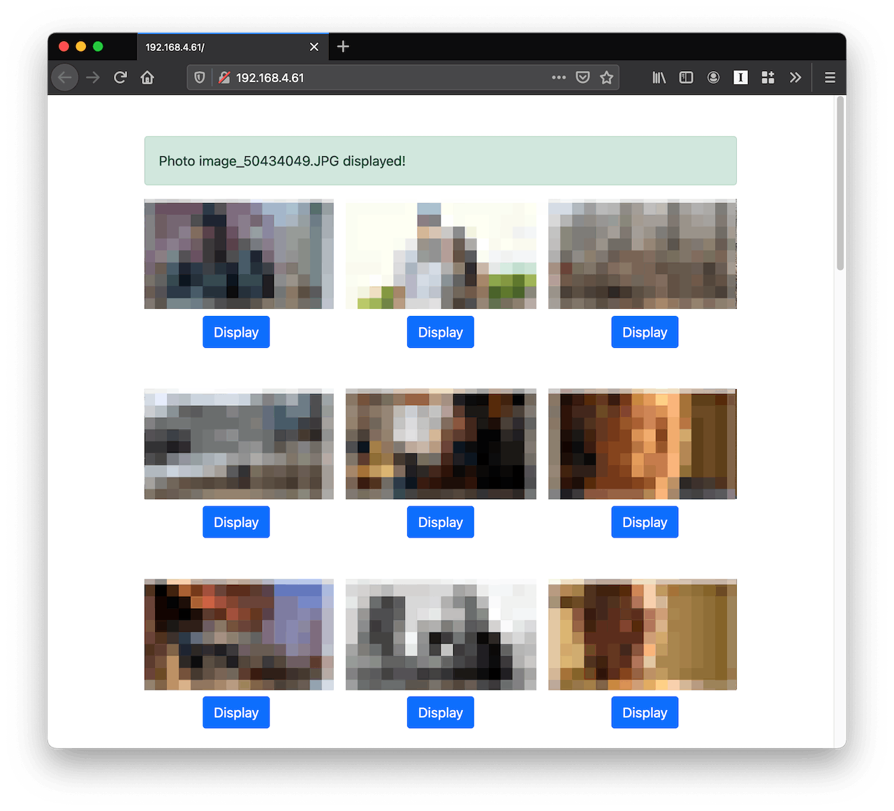
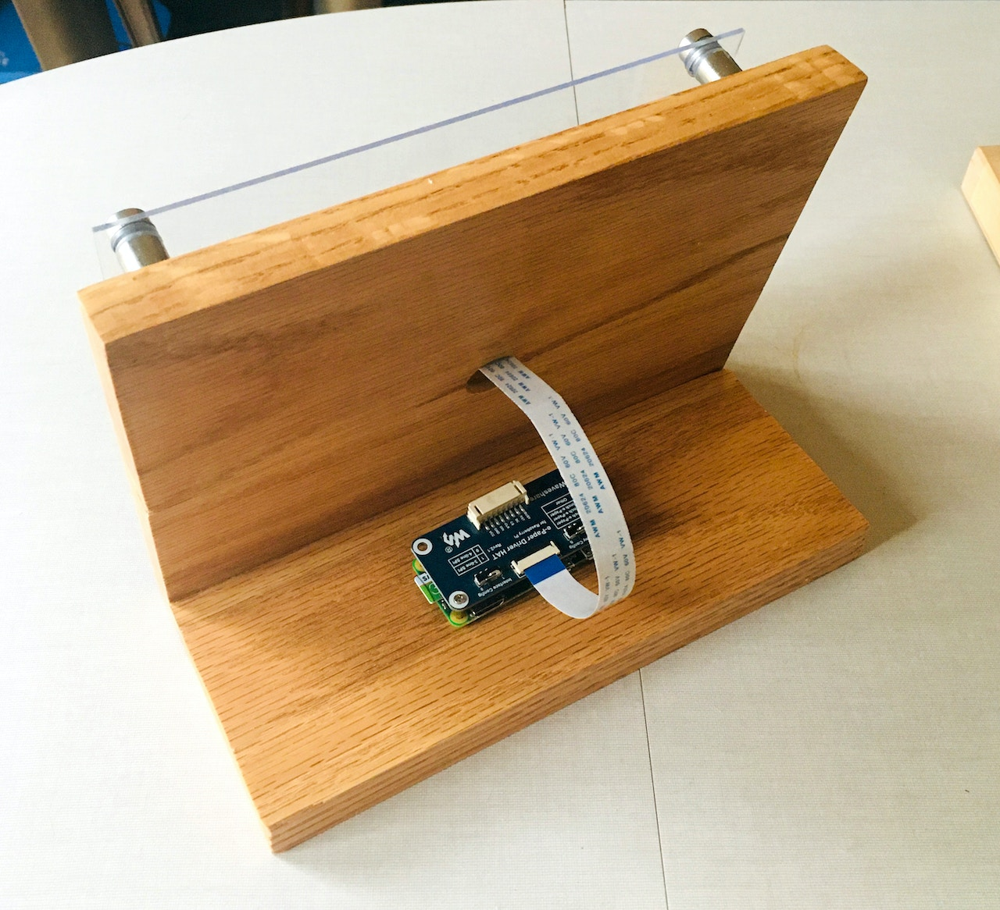

Over the winter, inspired by this [digital photo
frame](http://toolsandtoys.net/aura-mason-smart-digital-picture-frame/)
that uses email to add new photos, I built and programmed a trio of
e-paper picture frames for my family, and I thought it\'d be cool to
walk through the process in case someone out there wants to try
something similar.

In short, it\'s a Raspberry Pi Zero connected to a roughly 5-by-7-inch
e-paper screen, running some software I wrote in Go and living inside a
frame I put together. This project consists of four main parts:

1.  The email-to-S3 gateway, [described in detail in a previous
    post](https://www.viget.com/articles/email-photos-to-an-s3-bucket-with-aws-lambda-with-cropping-in-ruby/);
2.  The software to display the photos on the screen;
3.  Miscellaneous Raspberry Pi configuration; and
4.  The physical frame itself.

As for materials, you\'ll need the following:

-   [A Raspberry Pi Zero with
    headers](https://www.waveshare.com/raspberry-pi-zero-wh.htm)
-   [An e-paper
    display](https://www.waveshare.com/7.5inch-hd-e-paper-hat.htm)
-   A micro SD card (and some way to write to it)
-   Some 1x4 lumber (I used oak)
-   [4x metal standoffs](https://www.amazon.com/gp/product/B00TX464XQ)
-   [A 6x8 piece of
    acrylic](https://www.amazon.com/gp/product/B07J4WX7BH)
-   Some wood glue to attach the boards, and some wood screws to attach
    the standoffs

I\'ll get more into the woodworking tools down below.

[]{#the-email-to-s3-gateway}

## The Email-to-S3 Gateway [\#](#the-email-to-s3-gateway "Direct link to The Email-to-S3 Gateway"){.anchor aria-label="Direct link to The Email-to-S3 Gateway"}

Like I said, [I\'ve already documented this part pretty
thoroughly](https://www.viget.com/articles/email-photos-to-an-s3-bucket-with-aws-lambda-with-cropping-in-ruby/),
but in short, we use an array of AWS services to set up an email address
that fires off a Lambda function when it receives an email. The function
extracts the attachments from the email, crops them a couple of ways
(one for display on a webpage, the other for display on the screen), and
uploads the results into an S3 bucket.

[]{#the-software}

## The Software [\#](#the-software "Direct link to The Software"){.anchor aria-label="Direct link to The Software"}

The next task was to write the code that runs on the Pi that can update
the display periodically. I also thought it\'d be cool if it could
expose a simple web interface on the local network to let my family
members browse the photos and display them on the frame. When selecting
a language, I could have gone with either Ruby or Python, the former
since that\'s what I\'m most familiar with, the latter because that\'s
what [the code provided by
Waveshare](https://github.com/waveshare/e-Paper/tree/master/RaspberryPi_JetsonNano/python/lib/waveshare_epd),
the manufacturer, is written in.

But I chose neither of those options, reader, opting instead for Go. Why
Go, you ask?

-   **I wanted something robust.** Ideally, this code will run on these
    devices for years with no downtime. If something does go wrong, I
    won\'t have any way to debug the problems remotely, instead having
    to wait until the next time I\'m on the same wifi network with the
    failing device. Go\'s explicit error checking was appealing in this
    regard.

-   **I wanted deployment to be simple.** I didn\'t have any appetite
    for all the configuration required to get a Python or Ruby app
    running on the Pi. The fact that I could compile my code into a
    single binary that I could `scp` onto the device and manage with
    `systemd` was compelling.

-   **I wanted a web UI**, but it wasn\'t the main focus. With Go, I
    could just import the built-in `net/http` to add simple web
    functionality.

To interface with the screen, I started with [this super awesome GitHub
project](https://github.com/gandaldf/rpi). Out of the box, it didn\'t
work with my screen, I *think* because Waveshare offers a bunch of
different screens and the specific instructions differ between them. So
I forked it and found the specific Waveshare Python code that worked
with my screen ([this
one](https://github.com/waveshare/e-Paper/blob/master/RaspberryPi_JetsonNano/python/lib/waveshare_epd/epd7in5_HD.py),
I believe), and then it was just a matter of updating the Go code to
match the Python, which was tricky because I don\'t know very much about
low-level electronics programming, but also pretty easy since the Go and
Python are set up in pretty much the same way.

[Here\'s my
fork](https://github.com/dce/rpi/blob/master/epd7in5/epd7in5.go) --- if
you go with the exact screen I linked to above, it *should* work, but
there\'s a chance you end up having to do what I did and customizing it
to match Waveshare\'s official source.

Writing the main Go program was a lot of fun. I managed to do it all ---
interfacing with the screen, displaying a random photo, and serving up a
web interface --- in one (IMO) pretty clean file. [Here\'s the
source](https://github.com/dce/e-paper-frame), and I\'ve added some
scripts to hopefully making hacking on it a bit easier.

[]{#configuring-the-raspberry-pi}

## Configuring the Raspberry Pi [\#](#configuring-the-raspberry-pi "Direct link to Configuring the Raspberry Pi"){.anchor aria-label="Direct link to Configuring the Raspberry Pi"}

Setting up the Pi was pretty straightforward, though not without a lot
of trial-and-error the first time through:

1.  Flash Raspberry Pi OS onto the SD card
2.  [Configure your wifi
    information](https://www.raspberrypi.org/documentation/configuration/wireless/wireless-cli.md)
    and [enable
    SSH](https://howchoo.com/g/ote0ywmzywj/how-to-enable-ssh-on-raspbian-without-a-screen#create-an-empty-file-called-ssh)
3.  Plug it in --- if it doesn\'t join your network, you probably messed
    something up in step 2
4.  SSH in (`ssh pi@<192.168.XXX.XXX>`, password `raspberry`) and put
    your public key in `.ssh`
5.  Go ahead and run a full system update
    (`sudo apt update && sudo apt upgrade -y`)
6.  Install the AWS CLI and NTP (`sudo apt-get install awscli ntp`)
7.  You\'ll need some AWS credentials --- if you already have a local
    `~/.aws/config`, just put that file in the same place on the Pi; if
    not, run `aws configure`
8.  Enable SPI --- run `sudo raspi-config`, then select \"Interface
    Options\", \"SPI\"
9.  Upload `frame-server-arm` from your local machine using `scp`; I
    have it living in `/home/pi/frame`
10. Copy the [cron
    script](https://github.com/dce/e-paper-frame/blob/main/etc/random-photo)
    into `/etc/cron.hourly` and make sure it has execute permissions
    (then give it a run to pull in the initial photos)
11. Add a line into the root user\'s crontab to run the script on
    startup: `@reboot /etc/cron.hourly/random-photo`
12. Copy the [`systemd`
    service](https://github.com/dce/e-paper-frame/blob/main/etc/frame-server.service)
    into `/etc/systemd/system`, then enable and start it

And that should be it. The photo gallery should be accessible at a local
IP and the photo should update hourly (though not ON the hour as that\'s
not how `cron.hourly` works for some reason).

[]{#building-the-frame}

## Building the Frame [\#](#building-the-frame "Direct link to Building the Frame"){.anchor aria-label="Direct link to Building the Frame"}

This part is strictly optional, and there are lots of ways you can
display your frame. I took (a lot of) inspiration from this [\"DIY
Modern Wood and Acrylic Photo
Stand\"](https://evanandkatelyn.com/2017/10/modern-wood-and-acrylic-photo-stand/)
with just a few modifications:

-   I used just one sheet of acrylic instead of two
-   I used a couple small pieces of wood with a shallow groove to create
    a shelf for the screen to rest on
-   I used a drill press to make a 3/4\" hole in the middle of the board
    to run the cable through
-   I didn\'t bother with the pocket holes --- wood glue is plenty
    strong

The tools I used were: a table saw, a miter saw, a drill press, a
regular cordless drill (**do not** try to make the larger holes in the
acrylic with a drill press omfg), an orbital sander, and some 12\"
clamps. I\'d recommend starting with some cheap pine before using nicer
wood --- you\'ll probably screw something up the first time if you\'re
anything like me.

This project was a lot of fun. Each part was pretty simple --- I\'m
certainly no expert at AWS, Go programming, or woodworking --- but
combined together they make something pretty special. Thanks for
reading, and I hope this inspires you to make something for your mom or
someone else special to you.

*Raspberry Pi illustration courtesy of [Jonathan
Rutheiser](https://commons.wikimedia.org/wiki/File:Raspberry_Pi_Vector_Illustration.svg)*
