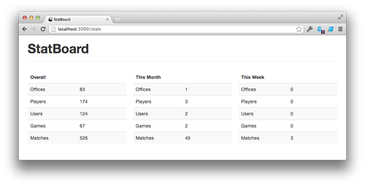

We build a lot of small apps here at Viget as part of [Pointless
Corp](http://pointlesscorp.com/), like
[SpeakerRate](http://speakerrate.com/),
[OfficeGames](http://officegam.es/), and
[BabyBookie](http://babybookie.com/). It's fun to track how many people
are using them, and rather than write yet another Rakefile to generate
reports, I decided to create a simple [Rails
Engine](http://edgeapi.rubyonrails.org/classes/Rails/Engine.html) to
display some basic stats. Announcing, then,
[StatBoard](https://github.com/vigetlabs/stat_board):

Installation is a cinch: add the gem to your Gemfile, mount the app in
`routes.rb`, and set the models to query (full instructions available on
the [GitHub
page](https://github.com/vigetlabs/stat_board#basic-configuration)). The
code itself is embarrassingly simple, so if you have any ideas for
improvements, or just want to see how a simple Rails Engine works, take
a look.
