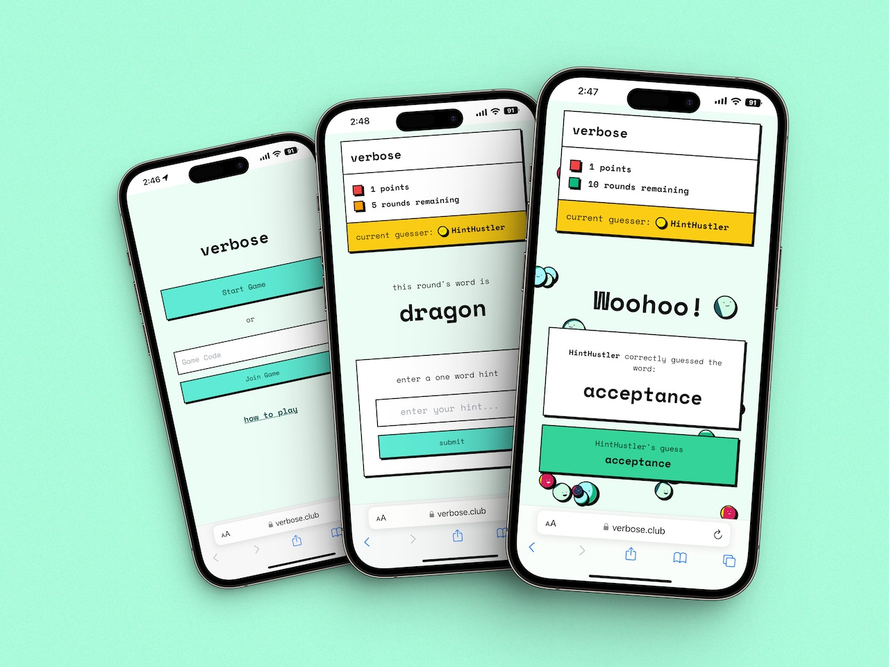
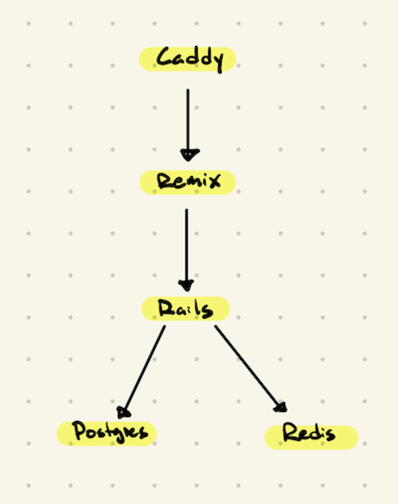

Fun group party game. Somehow incorporate AI. Build it quickly. These
were the constraints we put on our mostly Colorado-based Pointless Corp.
team before [Pointless
Palooza](https://www.viget.com/articles/the-enduring-point-of-pointless-corp/).
A few of us wanted to partake in the old Pointless tradition of trying
out another role on the project, so simplicity was key. Thankfully,
Haley was itching to build a digital version of a very fun, but
relatively straightforward, game.

[Just One](https://boardgamegeek.com/boardgame/254640/just-one) is a
collaborative word association game that encourages both teamwork and
creativity. On a given turn, everyone except one player (the Guesser)
knows a random mystery word and must attempt to get the Guesser to guess
the mystery word via one-word hints. The catch is that every hint must
be unique, so duplicate hints are eliminated and not shown to the
Guesser.

Haley mentioned that she often hacked the board game to accommodate more
than 7 players and thought that doing so added a fun element of chaos to
the rounds. A digital version of the game would facilitate expanding the
party and it seemed like an easy enough lift for our team.

It's easier to play than explain, so mosey on over to
[verbose.club](https://verbose.club) and give it a try. And, if you want
to know more about how each of us fared going heads down on one project
for 48 hours (and counting), read on.

## [**Haley**](https://www.viget.com/about/team/hjohnson/) **\| Pointless Role: Design \| Day Job: PM** {#haley-pointless-role-design-day-job-pm dir="ltr"}

**My favorite part of building verbose.club** was being granted
permission to focus on one project with my teammates. We hopped on Meets
or huddles to discuss requirements. Nicole and I jammed in the same
Figma file or wireframe. I got to drop everything to QA a 600-word word
bank. Viget has great ways of collaborating remotely, but it was also
fun to be part of the in-office crew, having late night snacks between
cram sessions like we were in college again.

**Something I learned**: I tried my hand at being a "designer" and
learned quickly that nothing is too precious. Sometimes the code
translates things differently. Also, design systems are essential to
throwing together screens quickly. And Figma has tons of libraries that
you can use instead of starting from scratch!

------------------------------------------------------------------------

## [**Haroon**](https://www.viget.com/about/team/hmatties/) **\| Pointless Role: Dev \| Day Job: Product Design** {#haroon-pointless-role-dev-day-job-product-design dir="ltr"}

**My favorite part of building verbose.club** was stepping into a new
role, or at least trying to. I got a chance to build out styled
components and pages for our game with React, Typescript, and Tailwind.
Though my constant questions for Andrew and David were likely annoying,
it was an extremely rewarding experience to see a project come to life
from another perspective.

**Something I learned** is that it\'s best to keep commits atomic,
meaning contributions to the codebase are small, isolated, and clear.
Though a best practice for many, this approach made it easier for me as
a novice to contribute quickly, and likely made it easier for Andrew to
fix things later.

------------------------------------------------------------------------

## [**Nicole**](https://www.viget.com/about/team/nrymarz/) **\| Pointless Role: Design \| Day Job: PM** {#nicole-pointless-role-design-day-job-pm dir="ltr"}

**My favorite part of building verbose.club** was seeing our team
immediately dive in with a "we're in this together" approach. I am still
relatively new to Viget and it was my first time working with a handful
of my teammates, so I really appreciated the collaborative environment
and how everyone was really open to hearing new ideas, trying something
new, and working together to make something cool.

**Something I learned** was how to use [Whimsical](http://whimsical.com)
and [Figma](http://figma.com) to make wireframes and designs. I had used
these tools before; but, it was my first time "building" anything at
Viget --- and it was super fun. I'm glad I got to try something outside
of my usual PM role.

------------------------------------------------------------------------

## [**Andrew**](https://www.viget.com/about/team/athomas/) **\| Pointless Role: CEO Dev \| Day Job: Dev**

**My favorite part of building verbose.club** was coordinating work
among my teammates. With less than 3 days to do everything, we had to
hit the ground running. To start, our PMs and designer jumped on
wireframing and design thinking while David brought to life a Rails
back-end & API. I was in a good spot to act as the messenger between
these two lines of work: parsing high-level thinking & decisions from
the designers into information useful to David in crafting the API; then
shuttling David's feedback back to the broader team.

Next up, it was time to build out the user-facing Remix app. We were
able to split this work into two parallel streams. I built out unstyled
screens, game business logic, and the necessary glue code, resulting in
a functional app with a barebones UI. In parallel, Haroon built out
high-fidelity screens, using static placeholders where dynamic content
would eventually live. From there, collaborating to merge our work and
upgrade the UI was a simple task.

I think our team came out of this project inspired by what can be
accomplished with smart coordination. We managed to efficiently build
consensus, parallelize work, and learn from one another --- and the
result speaks for itself.

**Something I learned** was that parallelizing a project is tricky and
communication is key. When multiple streams of work are progressing in
parallel, decisions are constantly being made --- some big, some small
--- and many having more influence than immediately apparent. Keeping
all contributors 100% in the loop is likely impossible, and certainly
unrealistic. Smart coordination and communication is the magic sauce
that makes it all work.

------------------------------------------------------------------------

## [**David**](https://www.viget.com/about/team/deisinger/) **\| Pointless Role: Dev \| Day Job: Dev** {#david-pointless-role-dev-day-job-dev dir="ltr"}

**My favorite part of working on verbose.club** was helping from afar. I
was 1,500 miles and several time zones away from most of the team, so I
really focused on doing low-level work that would enable the rest of the
team to be successful: setting up an API, getting the app running on
Docker for easy local development, and making it straightforward for
others to deploy code. It was sort of like being the bass player in a
rad band.

**Something I learned** is that [Caddy](https://caddyserver.com) is
super legit. Here's the entire web server config file, which
automatically sets up HTTPS and proxies traffic to our Remix app:

    verbose.club

    reverse_proxy remix-prod:3001

Our overall architecture (running with `docker compose`) looks like
this:

------------------------------------------------------------------------

In two days' time, we had a beautiful, functioning game that we played
during our Pointless celebration happy hour. Since then, we've added
some cool animations and the ability to pull in AI players --- no human
friends required! So, grab some friends (robot or otherwise) and check
out [verbose.club](https://verbose.club)!
