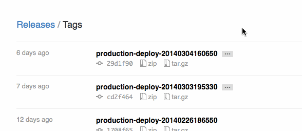

Managing deployments is one of the trickier aspects of creating software
for the web. Several times a week, a project manager will ask the dev
team something to the effect of "what's new since the last deploy?" --
if we did a deploy right now, what commits would that include?
Fortunately, the tooling around this stuff has never been better (as Tim
Bray says, ["These are the good old
days."](https://www.tbray.org/ongoing/When/201x/2014/01/01/Software-in-2014#p-8)).
Easy enough to pull this info via command line and paste a list into
Campfire, but if you're using GitHub and Capistrano, here's a nifty way
to see this information on the website without bothering the team. As
the saying goes, teach a man to `fetch` and whatever shut up.

## Tag deploys with Capistrano

The first step is to tag each deploy. Drop this recipe in your
`config/deploy.rb` ([original
source](http://wendbaar.nl/blog/2010/04/automagically-tagging-releases-in-github/)):

```ruby
namespace :git do
  task :push_deploy_tag do
    user = `git config --get user.name`.chomp
    email = `git config --get user.email`.chomp
    puts `git tag #{stage}-deploy-#{release_name} #{current_revision} -m "Deployed by #{user} <#{email}>"`
    puts `git push --tags origin`
  end
end
```

Then throw a `after 'deploy:restart', 'git:push_deploy_tag'` into the
appropriate deploy environment files. Note that this task works with
Capistrano version 2 with the
[capistrano-ext](https://rubygems.org/gems/capistrano-ext) library. For
Cap 3, check out [this
gist](https://gist.github.com/zporter/3e70b74ce4fe9b8a17bd) from
[Zachary](https://viget.com/about/team/zporter).

## GitHub Tag Interface

Now that you're tagging the head commit of each deploy, you can take
advantage of an (as far as I can tell) unadvertised GitHub feature: the
tags interface. Simply visit (or have your PM visit)
`github.com/<organization>/<repo>/tags` (e.g.
<https://github.com/rails/rails/tags>) to see a list of tags in reverse
chronological order. From here, they can click the most recent tag
(`production-deploy-2014...`), and then the link that says "\[N\]
commits to master since this tag" to see everything that would go out in
a new deploy. Or if you're more of a visual learner, here's a gif for
great justice:



------------------------------------------------------------------------

This approach assumes a very basic development and deployment model,
where deploys are happening straight from the same branch that features
are being merged into. As projects grow more complex, [so must your
deployment
model](https://viget.com/advance/successful-release-management-and-how-to-communicate-about-it).
Automatically tagging deploys as we've outlined here breaks down under
more complex systems, but the GitHub tag interface continues to provide
value if you're tagging your deploys in any manner.
